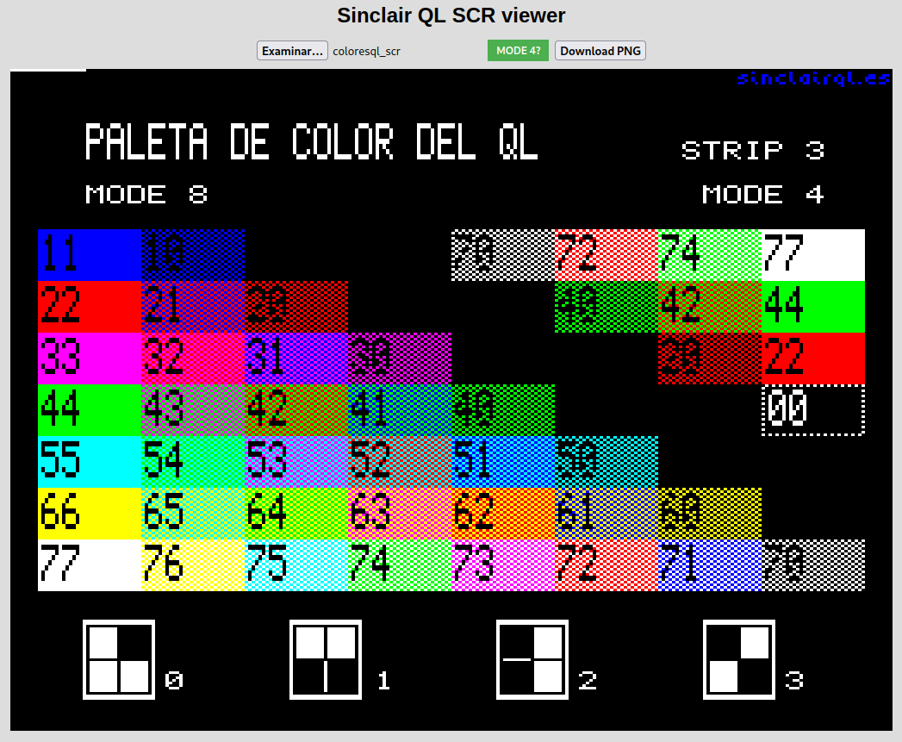

# Sinclair QL SCR viewer
v1.0

By: Javier Guerra

This application loads and displays classic Sinclair QL computer screens.

[Go to the application online](https://javguerra.github.io/Sinclair-QL-SCR-viewer)

Note: Requires JavaScript ES5 or higher to work.

## Info

This application is an HTML file that allows an image file in QL format located locally or remotely to be loaded into the browser, using an input button, and displays its content without CORS errors occurring, and without using a server.

The resulting image can be downloaded in PNG format with a size of 1024x768 pixels.

The application interprets the colors and format in MODE 8 and MODE 4 of the QL, with the colors of each pixel using the palette: black, blue, red, magenta, green, cyan, yellow and white for mode 8, and black, red, green and white for mode 4.

To represent the colors of the pixels in mode 8, the first byte of the file that is read will have the green component of each pixel encoded in its bits, with the following pattern per byte: GFGFGFGF, the second byte will have the green components encoded in bits. red and blue color of each pixel, with the following pattern per byte: RBRBRBRB, with G being green, R red and B blue, and so on until the end of the file. The F (flash) value is not used. If a bit has a value of 0, the value of its color component is zero. If it has value 1, the value of its color component is 255.

To represent pixel colors in mode 4, the pattern of each of the two bytes is GGGGGGGG and RRRRRRRR respectively. The value of color component B (blue) is set to 255 if the G and R values are 1.

To preserve the 4:3 aspect ratio of the image, the resolution of the displayed image is 1024x768, so that for each pixel in the original image in mode 8, four pixels are painted horizontally and three pixels vertically, and For each pixel in mode 4, two pixels are painted horizontally and three vertically.

The application automatically detects the image mode knowing that, if the entire image has its flash bits (F) set to 0, it is most certainly an image in mode 8, and that if there are any bits that correspond to the bits green color of the image in mode 4, then it is an image in this mode, and makes the switch to the appropriate display mode.

Once the image is loaded in the application, it is possible to change the display mode via the mode button.

The 'index.html' file is self-contained, and can be downloaded and used on an offline computer.

To test it, you can use the file 'qlcolors_scr' which is a screen image in mode 8.

__In Spanish__

Esta aplicación es un archivo HTML que permite cargar en el navegador un archivo de imagen en formato QL ubicado en local o en remoto, mediante un botón input, y mostrar su contenido sin que ocurran errores de CORS, y sin usar un servidor.

La imagen resultante puede descargarse en formato PNG con un tamaño de 1024x768 pixels.

La aplicación interpreta los colores y el formato en MODO 8 y en MODO 4 del QL, con los colores de cada pixel usando la paleta: negro, azul, rojo, magenta, verde, cian, amarillo y blanco para el modo 8, y negro, rojo, verde y blanco para el modo 4. 

Para representar los colores de los pixeles en modo 8, el primer byte del archivo que se lee tendrá codificado en sus bits el componente verde de cada pixel, con el siguiente patrón por byte: GFGFGFGF, el segundo byte tendrá codificados en bits los componentes de color rojo y azul de cada pixel, con el siguiente patrón por byte: RBRBRBRB, siendo G verde, R rojo y B azul, y así sucesivamente hasta final del archivo. El valor F (flash) no se usa. Si un bit tiene valor 0, el valor de su componente de color es cero. Si tiene valor 1, el valor de su componente de color es 255. 

Para representar los colores de los pixeles en modo 4, el patrón de cada uno de los dos bytes es GGGGGGGG y RRRRRRRR respectivamente. El valor del componente de color B (azul) se pone a 255 si los valores G y R están a 1.

Para conservar la proporción 4:3 de la imagen, la resolución de la imagen mostrada es de 1024x768, de tal forma que, por cada pixel en la imagen original en el modo 8 se pintan cuatro pixeles en horizontal y tres pixeles en vertical, y por cada pixel en modo 4 se pintan dos píxeles en horizontal y tres en vertical.

La aplicación detecta automáticamente el modo de imagen sabiendo que, si toda la imagen tiene sus bit de flash (F) a 0, con mucha seguridad se trata de una imagen en modo 8, y que si hay algún bit que se corresponde con los bits de color verde de la imagen en modo 4, entonces se trata de una imagen en este modo, y hace el cambio al modo de visualización adecuado.

Una vez cargada la imagen en la aplicación, es posible cambiar el modo de visualización a través del botón de modo.

El archivo 'index.html' es autocontenido, y se puede descargar y utilizar en una computadora fuera de línea.

Para probarlo, puedes usar el archivo 'qlcolors_scr' que es una imagen de pantalla en modo 8.

## Acknowledgments

My thanks to Dilwyn Jones for providing ideas and suggestions for automatic mode detection and other screen formats.

---
2024 · GPL v3 license
