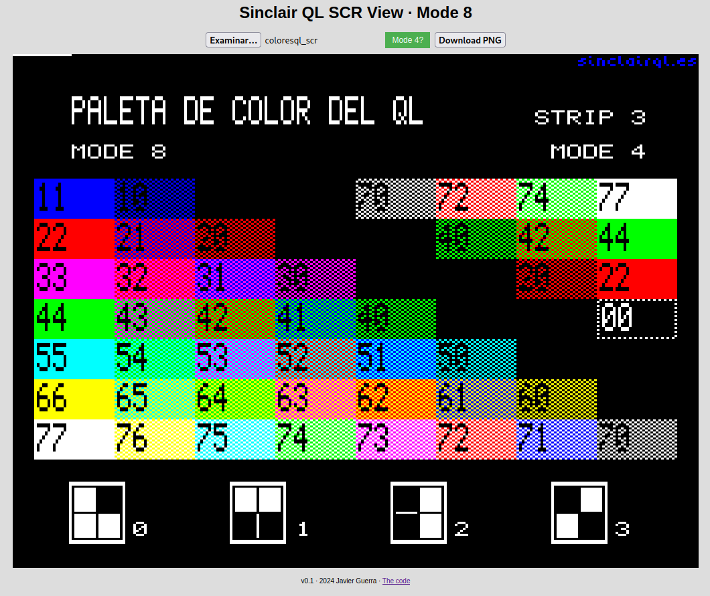

# QL SCR View
v1.0

By: Javier Guerra

This program load and display Sinclair QL computer screens.

[» Go to the APP online](https://javguerra.github.io/qlscrview/)

__The APP__

This application is an HTML file that allows an image file in QL format located locally or remotely to be loaded into the browser, using an input button, and displays its content without CORS errors occurring, and without using a server.

The program interprets the colors and format in MODE 8 and MODE 4 of the QL, with the colors of each pixel using the palette: black, blue, red, magenta, green, cyan, yellow and white for mode 8, and black, red, green and white for mode 4.

To represent the colors of the pixels in mode 8, the first byte of the file that is read will have the green component of each pixel encoded in its bits, with the following pattern per byte: GFGFGFGF, the second byte will have the red and red color components encoded in bits. blue of each pixel, with the following pattern per byte: RBRBRBRB, with G being green, R red and B blue, and so on until the end of the file. The F value is not used. If a bit has a value of 0, its RGB value is zero. If it has value 1, its RGB value is 255.

To represent pixel colors in mode 4, the pattern of each of the two bytes is GGGGGGGG and RRRRRRRR respectively. The blue B value is changed to 255 if the G and R values are 1.

The 'index.html' and 'index2.html' files can be downloaded and used on your computer.

To test it, you can use the file 'qlcolors_scr' which is a screen image in mode 8.

Although it is already functional, this application is under development.

__Spanish__

Esta aplicación es un fichero HTML que permite cargar en el navegador un fichero de imagen en formato QL ubicado en local o en remoto, mediante un botón input, y muestra su contenido sin que ocurran errores de CORS, y sin usar un servidor.

El programa interpreta los colores y el formato en MODO 8 y en MODO 4 del QL, con los colores de cada pixel usando la paleta: negro, azul, rojo, magenta, verde, cian, amarillo y blanco para el modo 8, y negro, rojo, verde y blanco para el modo 4. 

Para representar los colores de los pixeles en modo 8, el primer byte del fichero que se lee tendrá codificado en sus bits el componente verde de cada pixel, con el siguiente patrón por byte: GFGFGFGF, el segundo byte tendrá codificados en bits los componentes de color rojo y azul de cada pixel, con el siguiente patrón por byte: RBRBRBRB, siendo G verde, R rojo y B azul, y así sucesivamente hasta final del fichero. El valor F no se usa. Si un bit tiene valor 0, su valor RGB es cero. Si tiene valor 1, su valor RGB es 255. 

Para representar los colores de los pixeles en modo 4, el patron de cada uno de los dos bytes es GGGGGGGG y RRRRRRRR respectivamente. El valor B azul se cambia a 255 si los valores G y R son 1.

---
GPL 2024
